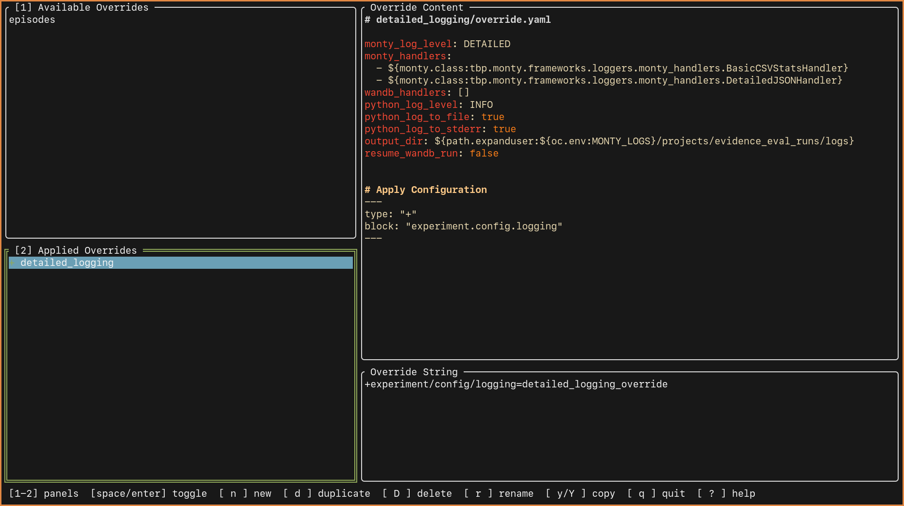

# LazyHydra

A terminal UI for managing [Hydra](https://hydra.cc/) configuration overrides, inspired by [lazygit](https://github.com/jesseduffield/lazygit).



## Features

- Browse available configuration overrides in an interactive TUI
- Apply and remove overrides with keyboard shortcuts
- Persist selections to `.envrc` for automatic environment setup via [direnv](https://direnv.net/)
- Generate override strings for Hydra CLI commands

## Installation

```bash
git clone https://github.com/yourusername/lazyhydra.git
cd lazyhydra
make clean install
```

This installs the `lazyhydra` binary to `~/.local/bin/`. Make sure this directory is in your `PATH`.

### Requirements

- Go 1.21+
- [direnv](https://direnv.net/) (for automatic environment variable loading)

## Configuration

Create a configuration file at `~/.config/lazyhydra/config.yaml`:

```yaml
# Environment variable name for storing the override string
env_var_name: HYDRA_OVERRIDES

# Directory containing your override definitions
overrides_dir: ~/myproject/conf/overrides

# File where state is persisted (direnv format)
project_env_file: .envrc
```

### Configuration Options

| Option | Default | Description |
|--------|---------|-------------|
| `env_var_name` | `HYDRA_OVERRIDES` | Environment variable that holds the override string |
| `overrides_dir` | `$PROJECT_ROOT/conf/overrides` | Path to directory containing override folders |
| `project_env_file` | `.envrc` | File for persisting state (must be in direnv format) |

**Variable substitution:**
- `~/path` expands to your home directory
- `$PROJECT_ROOT` expands to the `PROJECT_ROOT` environment variable, or the current working directory if unset

## Creating Overrides

Overrides are defined in folders within your `overrides_dir`. Each override folder contains two files:

```
overrides/
└── my_override/
    ├── apply.md       # Metadata and documentation
    └── override.yaml  # The actual configuration
```

### apply.md

The `apply.md` file uses YAML frontmatter to define how the override is applied:

```markdown
---
type: "+"
block: "experiment.config.logging"
---

Optional documentation about what this override does.
```

**Frontmatter fields:**

| Field | Description |
|-------|-------------|
| `type` | `"+"` for merge or `"="` for replace |
| `block` | The Hydra config path where this override applies |

### override.yaml

The `override.yaml` file contains the actual configuration values:

```yaml
log_level: DEBUG
handlers:
  - ${class:myproject.handlers.DebugHandler}
output_dir: ${path.expanduser:~/logs}
```

### Example

To create an override that enables detailed logging:

**overrides/detailed_logging/apply.md:**
```markdown
---
type: "+"
block: "experiment.config.logging"
---

Enables detailed logging with debug output.
```

**overrides/detailed_logging/override.yaml:**
```yaml
log_level: DEBUG
log_to_file: true
log_to_stderr: true
```

## Usage

### Interactive TUI

Launch the interactive interface:

```bash
lazyhydra
```

### Keybindings

| Key | Action |
|-----|--------|
| `1` `2` `3` | Jump to panel |
| `Tab` / `Shift+Tab` | Cycle panels |
| `h` / `l` | Previous / Next panel |
| `j` / `k` | Move down / up |
| `Space` / `Enter` | Toggle override (apply or remove) |
| `n` | Create new override |
| `d` | Delete override (with confirmation) |
| `e` | Edit `apply.md` in `$EDITOR` |
| `E` | Edit `override.yaml` in `$EDITOR` |
| `?` | Show help |
| `q` / `Esc` | Quit |

### CLI Modes

```bash
lazyhydra           # Launch interactive TUI
lazyhydra -l        # List all overrides and their status
lazyhydra -p        # Print the current override string
lazyhydra -h        # Show help
```

### Using with Hydra

After selecting overrides in LazyHydra, the override string is stored in your `.envrc`. You can use it in your Hydra commands:

```bash
# The HYDRA_OVERRIDES variable is automatically set by direnv
python train.py $HYDRA_OVERRIDES_STR
```

Or print it directly for use in scripts:

```bash
python train.py $(lazyhydra -p)
```
